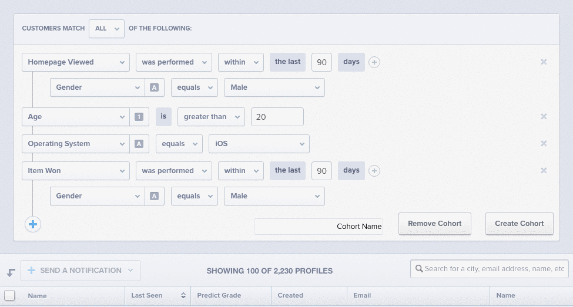
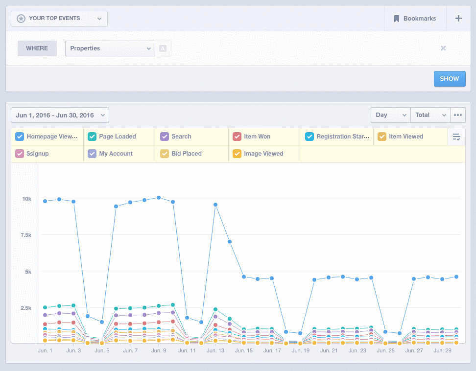

# mixpanel-custom-cohorts
Mixpanel Custom Cohorts

A Chrome extension to enable adding and removing of custom cohorts within the Mixpanel web app.

To install the extension:

1. Download this folder and unzip
2. Open Chrome Settings, click "Extensions" in the menu, then "Load unpacked extension..."
3. Select the unzipped folder

Once installed, you can create Cohorts directly from the Mixpanel Explore report like:

You can then use the Cohorts you created using the Cohorts property in any Mixpanel report:

Notes around usage of this extension:
- This extension runs in your browser, so you will need to leave the window open until users are processed (indicated by the button becoming active again) for the extension to work
- Due to browser limitations, this extension will process users at a rate of ~50K users per minute
- This extension has not been tested for high volume (1 million plus users)